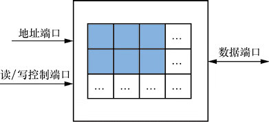

# 2.1 算术指令

## 指令集体系架构(ISA)
- ARM
- Intel x86
- PowerPC
- MIPS
- RISC-V

### RISC-V
- RISC-V 指令集架构是一种开放免授权费的精简指令集
- RISC-V 相对于复杂的指令集x86架构，更为简洁高效
- RISC-V 生态系统支持共享开放软件系统构建

## Assembly Variables:Register(汇编语言变量:寄存器)
- 汇编的变量通过寄存器实现，为了硬件设计简单
- 汇编语言不使用变量作为操作数
- 汇编的操作数是寄存器：CPU中采用有限数量的寄存器，造作直接在寄存器中完成
- 优点：硬件化的寄存器的数据传递与处理速度非常快
- 缺点：寄存器是硬件实现的，因此寄存器的数量是有限的
- 设计采用的通用原则：数量适量，少而快（RISC-V 采用的是32位寄存器，小而快）

### 寄存器
    寄存器（Register）是什么？
    现代高性能 CPU 中几十个寄存器也就够用了。

    寄存器（Register）是 CPU 中用于存储数据的单元。在运算器、控制器中，都需要有记忆功能的单元来保存从存储器中读取的数据，以及保存运算器生成的数据，这样的单元就是寄存器。

    这一系列单元使用“寄存器”的名称主要是为了和存储器（Memory）相区分。两者都有记忆功能，区别在于：

        存储器是位于 CPU 外部的独立模块；
        而寄存器是位于 CPU 内部的单元。


    存储器的容量要远远大于寄存器。存储器保存了程序的输入数据和最终结果，而寄存器保存的是计算过程中的中间数据，更具有“瞬时性”。

    寄存器有以下种类。
    1) 数据寄存器
    用于保存从存储器中读取的数据，以及运算器生成的结果。针对不同的数据类型，又可以分为整数寄存器、浮点寄存器。
    1) 指令寄存器
    用于保存从存储器中读取的指令，指令在执行之前先暂时存放在指令寄存器中。
    1) 地址寄存器
    用于保存要访问内存的地址。它也分为两种：

        一种用于保存 CPU 下一条要执行的指令地址，这种寄存器又称为程序地址计数器（Program Counter，PC）；
        另一种用于保存指令要访问的内存数据的地址。

    1) 标志位寄存器
    用于保存指令执行结果的一些特征，例如一条加法指令执行后，结果是否为 0、是否溢出（Overflow，即超出数据寄存器的最大位宽）等。这些特征在标志位寄存器中以特定的位进行表示，可以供程序对计算结果进行判断。

    寄存器的一个重要概念是“位宽”，即一个寄存器包含的二进制位的个数。通常所说的“CPU是多少位”也就是指 CPU 中寄存器的位宽。

    更大的位宽意味着计算机能表示的数据范围更大、计算能力更强，但也增加了 CPU 的设计和实现成本。历史上的 CPU 从 8 位、16 位发展而来，现在的计算机绝大多数采用 32 位或 64 位的 CPU。

    64 位 CPU 已经满足绝大多数现实生活中的信息处理需求，主流台式计算机、服务器暂时没有 128 位 CPU 的实际需求。龙芯1号都是 32 位的，龙芯2号、3号都是 64 位的。

    CPU 中经常将一组寄存器单元使用一个模块来实现，形成寄存器堆。寄存器堆的典型结构包含3个端口：

        一个是地址端口（用来选择要读写的寄存器编号）；
        一个是读/写控制端口（控制是向寄存器单元写入还是从寄存器单元读出）；
        一个是数据端口（从寄存器单元读出或向寄存器单元写入的数据）。


    寄存器堆的典型结构



## 寄存器
- 在RISC-V中一共有32个寄存器，编号为x0-x31
- x0寄存器是最特殊的，总是保持为零值

### 汇编和高级语言的区别
- 高级语言的变声明事先声明确定类型的，如 int a; char Variables
- 高级语言中每个变量只能表示这种类型的一个值
- 而在汇编中
- 寄存器中的值以何种方式处理是由指令操作所决定的

### 汇编指令
- 在汇编中每条语句都会执行一条简单的指令
- 与高级语言不同的是，每条汇编代码至多只代表一条汇编指令
- 这些汇编指令代表的是高级语言中的 +， -， *， /   

### 汇编中的注释符
- 与python相似，RISC-V中的注释符是 #
- 不同的是没有多行注释的提示符

## RISC-V语言
### 加法语言
- 语法：***add x1, x2, x3***
- 对应的C语言：a = b + c;  // a = x1   b = x2    c = x3 

### 减法语言
- 语法：***sub x3, x4, x5***
- 对应的C语言：d = e - f;  // d = x3   e = x4    f = x5

### 加减法的混合运算
- 目标：a = b + c + d - e;
- 实现：
```Assembly
add x10, x1, x2
add x10, x10, x3
sub x10, x10, x4
```
### 立即数的加法运算
- 语法：addi x19, x1, 10
- C: f = g + 10;
- Tips:立即数没有减法，在精简指令集设计中，设计的操作类型越少越好
-      所以一个立即数减法，可以转化成加上这个立即数的相反数 如  addi x20, x1, -10 

### 零值 x0
- 在RISC-V中，由于0使用很多，于是设计了一个寄存器为x0,通过硬连线的方式固定为0
- add x1, x2, x0
- 同时x0寄存器的值也不会因为其他操作而被改写

## 存储器中的大端和小端
- 大端和小端是指字节在存储器中存储顺序的两种方式
- 大端是把一个字的最低位字节存储在最高位字节地址上
- 小端是把一个字的最低位字节存储在最低位字节地址上

## 杂项
- 计算机系统中不同格式的数据有的会低于32位，但很少有低于8位，因此使用8位作为单位数据以8位的倍数来储存数据
- 8位的数据量常常被称为一个字节，所以一个32位的字是由四个字节组成的
- 在RISC-V的存储系统中 是以字节为单位寻址的
- 每一个字地址可以拆分到4个字节地址，在小端系统中某个字的地址与它的最低位地址是相同的
